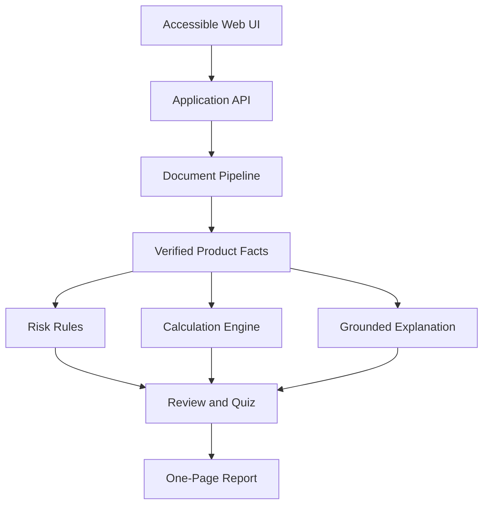

# Money Lens MVP Architecture

## 1. Design Principle

The system separates probabilistic extraction and explanation from authoritative rules and calculations. The LLM proposes structured facts and grounded language; deterministic components decide risk matches and money results.

## 2. Proposed Deployment Shape

This is a proposal, not an irreversible choice. See ADR-0003.

| Layer | Proposed MVP implementation | Responsibility |
|---|---|---|
| Web | Next.js 16 + TypeScript on Node.js 24 LTS, managed with npm | Upload, accessible review UI, simulation form, quiz, printable report |
| API | FastAPI + Python 3.12 using `venv` and pinned requirements | Orchestration, validation, document status, report data |
| Document pipeline | OCR/layout adapter + schema-constrained extraction | Page text, coordinates, normalized candidate facts |
| Rules | Versioned Python rules | Severity and review state from verified facts |
| Calculations | Pure tested Python functions | Authoritative amounts, rates, dates, assumptions, rounding |
| Persistence | In-memory walking-skeleton adapter; managed store after spike | Metadata, facts, rule results, attempts; never raw logs |
| Object storage | Docker Compose MinIO locally; S3-compatible adapter in demo | Temporary encrypted source documents and generated reports |
| Hosting | AWS serverless for short requests; container runtime for long/streaming work | Demo deployment and observability |

## 3. Processing Sequence

1. API validates file signature, type, and configured limits.
2. Raw file receives a random identifier and retention deadline.
3. OCR/layout adapter returns page text and coordinates.
4. Extraction returns schema-constrained candidate facts with source spans.
5. Validator normalizes units and checks required fields, evidence, confidence, and conflicts.
6. Unresolved facts become `needs_review`; they are not promoted by explanation text.
7. Rule engine evaluates verified facts and records matched rule versions.
8. Calculation engine accepts only validated explicit inputs and verified product facts.
9. Explanation generator receives verified facts, stored rule results, and stored calculation outputs.
10. Quiz and report are generated from the same immutable review snapshot.

## 4. Trust Boundaries

| Boundary | Allowed | Forbidden |
|---|---|---|
| OCR/extractor | Propose text, locations, candidate values, confidence | Declare a definitive protection or loss without validation |
| Fact validator | Normalize, reject, mark ambiguity | Invent a missing value |
| Rule engine | Match versioned conditions | Use free-form model judgment as the severity source |
| Calculation engine | Produce numeric results from tested formulas | Delegate arithmetic to an LLM |
| Explanation generator | Rephrase verified inputs and outputs | Add new facts, numbers, promises, or advice |
| UI/report | Present provenance and uncertainty | Hide `needs_review` or imply guaranteed outcomes |

## 5. Reliability and Demo Strategy

- All external providers sit behind interfaces so fixtures can run locally.
- Each processed document produces an immutable review snapshot identified by fact-set, rule, and formula versions.
- The primary demo document is processed and stored as a golden fixture before the event.
- Live upload is supported, but a labeled fallback uses the same downstream contract.
- Provider failures return explicit partial states; they never silently reuse another document’s result.

## 6. Open Architecture Decisions

- Final persistence choice after querying and time-to-ship spike.
- Synchronous versus queued live processing based on measured OCR/model latency.
- Exact public-demo access controls beyond the agreed anonymous rate, retention, concurrency, budget, and kill-switch limits.
